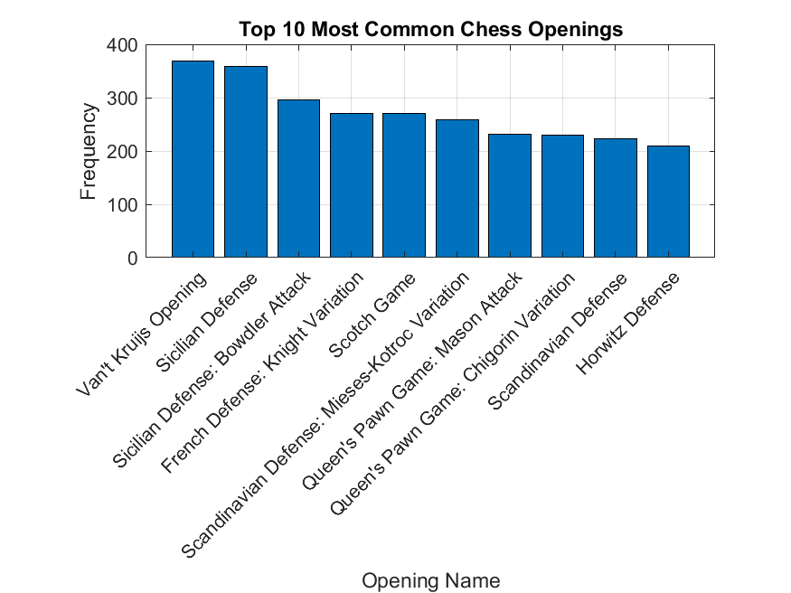

# Chess Openings Analysis from Lichess Games

<table>
<tr>
    <td></td>
    <td></td>
    <td></td>
    <td></td>

</tr>
</table>

## Overview
This MATLAB application analyzes the top 10 most common chess openings from over 20,000 games on Lichess, as collected by Mitchell J on [Kaggle](https://www.kaggle.com/datasets/datasnaek/chess/data). The application processes the data, generates a visual plot of the openings, and saves the results to a specified directory.

## Getting Started

### Prerequisites
Ensure MATLAB is installed on your system.

### Setup
Clone the repository to your local machine:
```bash
git clone git@github.com:daniel-chou-rainho/MostCommonChessOpenings.git
```

Before running any scripts, execute the `setup.m` script to set the necessary MATLAB paths:
```matlab
setup
```

### Running the Application
To run the application and generate the plot:
```matlab
main("data/games.csv", "results")
```
This command processes the data from `games.csv` and outputs the plot in a pop-up window and saves it to the `results` directory.

## Tests
Run individual unit tests using:
```matlab
runtests('tests/testLoadData')
runtests('tests/testProcessData')
runtests('tests/testPlotOpenings')
runtests('tests/testSaveResults')
```

To run all unit tests at once:
```matlab
runtests('tests')
```

## Continuous Integration
A GitHub Action exists to run all unit tests automatically on each push or pull request in the `.github/workflows` directory.

## Results
The analysis processed over 20,000 chess games to determine the frequency of various chess openings. Below are the top 10 most common openings:


